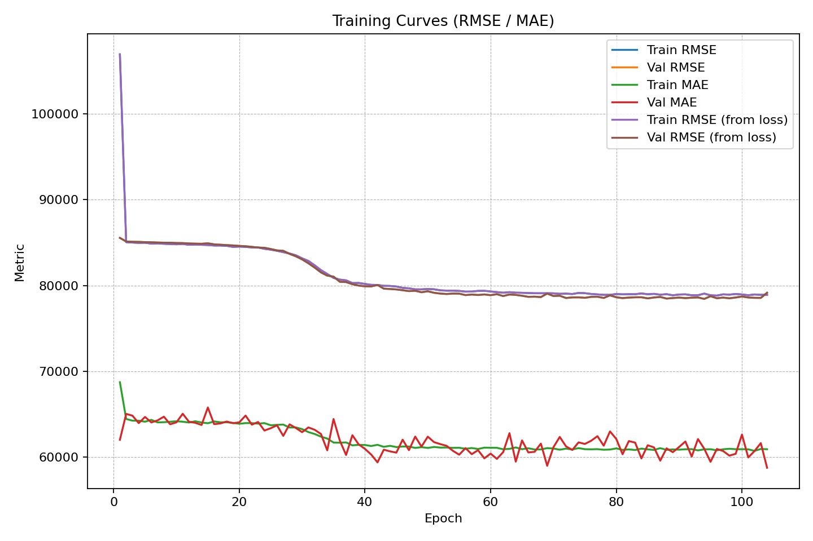

🌾 AgriVision — Crop Yield Modeling (ML + Plots + Prediction)

AgriVision is a practical end-to-end ML pipeline that ingests multiple agri datasets (yield, rainfall, temperature, pesticides), builds a robust training table without memory blowups, trains two models (RandomForest & Keras MLP), saves reusable artifacts, and generates training curves + feature correlation heatmap. A separate prediction script produces batch predictions for new data.

✅ Optimized for Windows paths you provided (e.g., C:\Users\sagni\Downloads\Agri Vision\...)
✅ Memory-safe merges (pre-aggregates side tables and avoids year-only cartesian joins)
✅ Robust target construction (yield is detected or computed from production/area)
✅ Works in both Terminal and Jupyter/VS Code

🗂️ Project Layout
C:\Users\sagni\Downloads\Agri Vision\
├── archive\
│   ├── pesticides.csv
│   ├── rainfall.csv
│   ├── temp.csv
│   ├── yield.csv
│   └── yield_df.csv
├── agrivision_train_and_plot.py   # train + plots in one
├── agrivision_predict_nocli.py    # prediction (Jupyter/Terminal friendly)
├── yield_sklearn_pipeline.pkl     # (created after training)
├── yield_mlp.h5                   # (created after training)
├── preprocessor_only.pkl          # (created after training)
├── agrivision_config.yaml         # (created after training)
├── metrics.json                   # (created after training)
├── sample_predictions.csv         # (created after training)
├── history.csv                    # (created after training, for curves)
├── training_frame.csv             # (created after training, for heatmap & schema)
├── accuracy_curve.png             # (created after training)
└── corr_heatmap.png               # (created after training)

🔧 Requirements

Python 3.10+ (tested on 3.11)

Packages:

pip install pandas numpy scikit-learn tensorflow pyyaml joblib matplotlib

If you use GPU for TensorFlow, install the appropriate tensorflow build for your CUDA stack.

📥 Data Inputs

Place the following CSVs under:

C:\Users\sagni\Downloads\Agri Vision\archive\

pesticides.csv

rainfall.csv

temp.csv

yield.csv

yield_df.csv

The training script will automatically detect a yield column (various naming allowed) or compute it as production / area.
Side tables (rainfall/temp/pesticides) will be aggregated and joined only if they share ≥ 2 keys with the yield table (e.g., ['year','state']), preventing memory blowups.

🏃 Run: Train + Plot (one step)

Terminal (recommended):

cd "C:\Users\sagni\Downloads\Agri Vision"
python agrivision_train_and_plot.py

This will create:

Models: yield_sklearn_pipeline.pkl, yield_mlp.h5, preprocessor_only.pkl

Metadata: agrivision_config.yaml, metrics.json, sample_predictions.csv

Plot data: history.csv, training_frame.csv

Plots: accuracy_curve.png (RMSE/MAE vs epoch), corr_heatmap.png (numeric feature correlations)

What’s happening inside:

Reads & normalizes CSVs.

Builds anchor table that guarantees a yield target.

Aggregates side tables (mean, sum, max, min) on safe keys and left-joins to anchor.

Trains:

RandomForest (sklearn pipeline with preprocessing → .pkl)

Keras MLP (dense neural net → .h5)

Saves plots & artifacts.

📊 Plots You Get

accuracy_curve.png
Train/Val RMSE & MAE across epochs (plus RMSE derived from MSE if metrics missing).

corr_heatmap.png
Numeric-only feature correlation matrix from training_frame.csv.

🔮 Batch Prediction
Option A) Notebook / VS Code (no argparse)

Use agrivision_predict_nocli.py (Jupyter-friendly).

Open the file and set:

INPUT_PATH  = r"C:\Users\sagni\Downloads\Agri Vision\new_batch.csv"  # your new data
OUTPUT_PATH = r"C:\Users\sagni\Downloads\Agri Vision\predictions.csv"
run_main_in_ipynb = True

Run the file/cell. It will:

Load artifacts (.pkl, .h5, preprocessor_only.pkl, training_frame.csv)

Align columns to the training schema (adds missing as NaN)

Output pred_rf, pred_mlp, pred_avg (plus ID columns if present)

Option B) Terminal (lightweight CLI)
python agrivision_predict_nocli.py --input "C:\Users\sagni\Downloads\Agri Vision\new_batch.csv" --out "C:\Users\sagni\Downloads\Agri Vision\predictions.csv"

Expected input schema:

Same kind of columns as used during training, without the yield column.

The script uses training_frame.csv to align your columns.

Common ID keys (year, state, district, crop, season, region, block) are passed through to the output for traceability.

🧠 Modeling Details

Preprocessing

Numeric → StandardScaler(with_mean=False)

Categorical → OneHotEncoder(handle_unknown='ignore') (auto-handles scikit-learn 1.3/1.4 arg change)

Models

RandomForestRegressor(n_estimators=300, n_jobs=-1, random_state=42)

Keras MLP: 256 → 128 → 64 with Dropout; optimizer Adam(1e-3); loss MSE; metrics RMSE & MAE; early stopping on val RMSE

Evaluation

Reported on hold-out validation set: R², MAE, RMSE in metrics.json

Artifacts

yield_sklearn_pipeline.pkl → Full sklearn pipeline (preprocessing + RF).

preprocessor_only.pkl → Fitted ColumnTransformer (used to feed Keras).

yield_mlp.h5 → Keras model.

training_frame.csv → Final training table (features + yield) used for plotting and prediction schema.

⚠️ Troubleshooting

MemoryError on merges
The script aggregates side tables and requires ≥ 2 common keys (e.g., ['year','state']) to avoid cartesian explosions. If a table shares only ['year'], it’s skipped with a warning (training proceeds).

ValueError: Could not find or compute 'yield'
Ensure yield.csv or yield_df.csv contains a yield column (any common naming is OK) or contains both production and area (any naming variants). The script tries multiple regex matches automatically.

OneHotEncoder.__init__() got an unexpected keyword argument 'sparse'
You’re on scikit-learn ≥ 1.4 (uses sparse_output). The script already handles this; ensure you’re running the latest files.

Plots missing (history.csv not found)
Run agrivision_train_and_plot.py first—this generates history.csv and training_frame.csv.

Jupyter argparse errors
Use agrivision_predict_nocli.py (no argparse). Or call the internal predict_file() function directly.

🧪 Quick Snippets

Train + Plot (one command):

python agrivision_train_and_plot.py

Predict from a new CSV (terminal):

python agrivision_predict_nocli.py --input "C:\Users\sagni\Downloads\Agri Vision\new_batch.csv" --out "C:\Users\sagni\Downloads\Agri Vision\predictions.csv"

Predict from a notebook (function call):

from agrivision_predict_nocli import predict_file
predict_file(r"C:\Users\sagni\Downloads\Agri Vision\new_batch.csv",
             r"C:\Users\sagni\Downloads\Agri Vision\predictions.csv",
             include_ids=True)

🧾 License

Use, modify, or extend freely for research and portfolio projects.
If you open-source, consider adding a standard license (MIT/BSD/Apache-2.0).

📣 Notes & Extensions

Add residual analysis and pred vs. true scatter after training for deeper diagnostics.

Integrate SHAP for feature importance explanations.

Replace RF with LightGBM/XGBoost and compare metrics.

Persist schema (feature dtypes) into YAML to enforce stricter validation on prediction time.

Wire into a FastAPI endpoint for live scoring.
Author
Sagnik Patra
